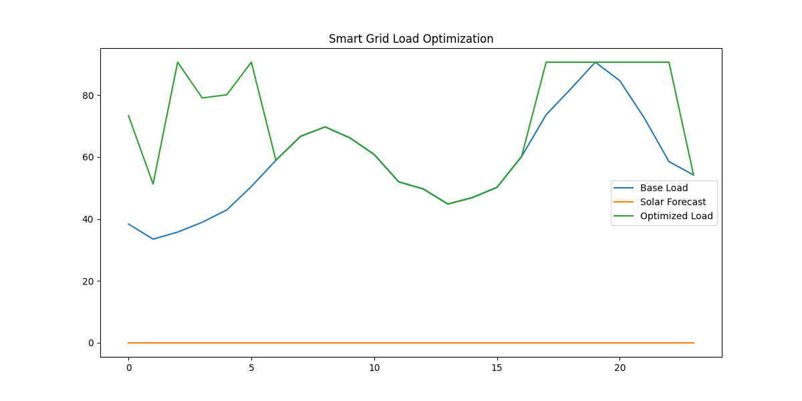

# ⚡ Smart Grid Optimization using Machine Learning & Linear Programming

An intelligent energy management system that combines **solar power forecasting**, **EV charging optimization**, **dynamic pricing**, and **battery storage scheduling** to minimize peak load and improve grid efficiency.

---

## 📌 Problem Statement

The rapid adoption of:

- Electric Vehicles 🚗
- Renewable Energy ☀️
- Dynamic electricity pricing 💰

creates **peak load stress** on the power grid.

This project proposes a **data-driven smart grid optimization framework** that:

✔ Forecasts solar generation using ML  
✔ Models residential demand  
✔ Schedules EV charging overnight  
✔ Applies Linear Programming for peak reduction  

---

## 🎯 Objectives

- Reduce transformer overload
- Minimize peak demand
- Optimize EV charging schedule
- Utilize solar power efficiently
- Lower energy cost using dynamic pricing

---

## 🏗️ System Architecture

---

## ⚙️ Tech Stack

### 👨‍💻 Machine Learning
- Random Forest Regressor – Solar power forecasting

### 📊 Optimization
- Linear Programming (PuLP – CBC Solver)

### 📦 Data Handling
- Pandas
- NumPy

### 📈 Visualization
- Matplotlib

### ☁️ Dataset
- Kaggle – Solar Power Generation Data

---

## 📂 Project Structure                                                
---

## 🔄 Workflow

### 1️⃣ Data Ingestion
- Automatically downloads solar dataset from Kaggle

### 2️⃣ Solar Power Forecasting
- Random Forest model predicts 24-hour generation

### 3️⃣ Load Simulation
- Synthetic residential demand curve

### 4️⃣ EV Charging Model
- Realistic overnight charging constraints

### 5️⃣ Dynamic Pricing
- Time-of-use electricity tariff

### 6️⃣ Optimization Engine
Objective:                                                                    
Subject to:

- Transformer capacity limit
- EV energy requirement
- Charging time window

### 7️⃣ Result Generation
- Optimized load curve
- Saved as image

---

## 📊 Output

### Optimized Grid Load

---
